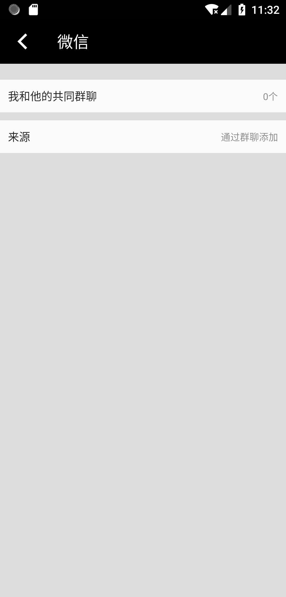

# wechat_ui

Flutter Demo Project, Demo UI 模仿微信界面

## Screen Shot

## License

本程序代码为Flutter Demo学习代码，
微信及其相关图标属于腾讯公司。

## Getting Started

This project is a starting point for a Flutter application.

A few resources to get you started if this is your first Flutter project:

- [Lab: Write your first Flutter app](https://flutter.io/docs/get-started/codelab)
- [Cookbook: Useful Flutter samples](https://flutter.io/docs/cookbook)

For help getting started with Flutter, view our 
[online documentation](https://flutter.io/docs), which offers tutorials, 
samples, guidance on mobile development, and a full API reference.
